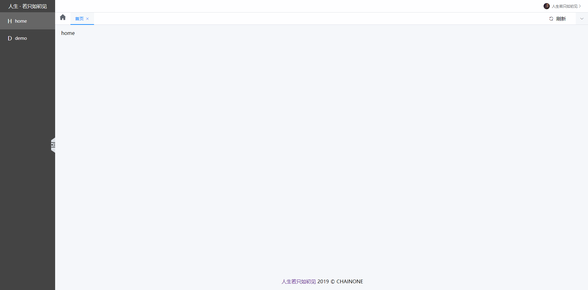

# admin-template

## 介绍

本项目为vue框架构建的基础后台系统，clone后，可在此基础上做深层次开发




## 依赖

axios、vue-router、axios、scss、pug、axios、element-ui、echarts、vuex

## 基础配置

1. axios基础封装
2. 路由基础配置
3. css清空基础样式
4. utils基础工具js

## node命令

1. 跑node命令快捷创建文件

1> 快速在pages文件下创建文件夹

2> 创建文件的router路由

3> 创建文件的scss文件

例：

```js
yarn page login // 创建pages/login/index.vue、scss/pages/login.scss、添加router/routes路由
```

2. 重置demo页内容

demo页为开发人员编写demo的地方

例：

```js
yarn clear // 快速重置demo页内容
```


